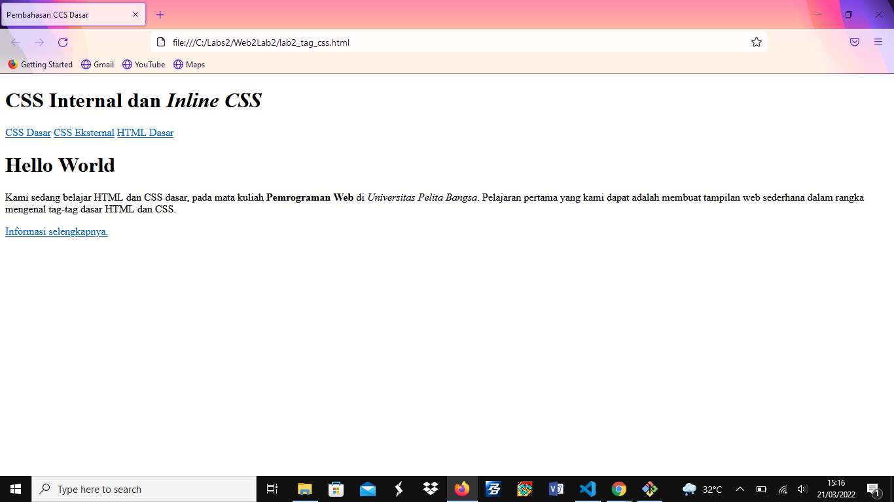

## Nama: Dimas Riyadh Alfajri
## Nim: 312010029
## Kelas: TI.20.A1
## Matkul: Pemrograman Web

# Web2Lab2
# Praktikum 2 : Pembahasan Tentang CSS Dasar

## Pengertian CSS
CSS adalah kepanjangaan dari Cascading Style Sheets yang berguna untuk menyederhanakan proses pembuatan website dengan mengatur elemen yang tertulis di bahasa markup.nCSS dipakai untuk mendesain halaman depan atau tampilan website (front end). CSS menangani tampilan dan ‘rasa’ dari halaman website. Ada banyak hal yang dapat Anda lakukan menggunakan CSS dibandingkan dengan bahasa pemrograman inti seperti HTML dan PHP. Ketika menggunakan CSS, Anda dapat mengatur warna teks, jenis font, baris antar paragraf, ukuran kolom, dan jenis background yang dipakai. Tidak hanya itu CSS juga bisa untuk mendesain layout, variasi tampilan di berbagai perangkat yang berbeda, dan berbagai efek yang dipakai di dalam website. CSS sangat mudah dipelajari, tapi juga powerful karena dapat mengontrol penyajian tampilan dari dokumen HTML. Mulai dari yang simpel sampai kompleks. Tidak heran jika saat ini CSS hampir dipakai di berbagai website untuk dikombinasikan dengan HTML maupun PHP.

## Fungsi CSS
Anda pernah mencoba mengembangkan website menggunakan HTML atau PHP? Jika sudah, Anda pasti merasakan sedikit kesulitan untuk mendesain tampilannya. Apalagi jika membuat tampilan yang cukup kompleks di proyek yang besar. HTML memang bukan dikembangkan untuk mendesain tampilan depan website. Lalu, bagaimana membuat tampilan website yang menarik dengan mudah? Menggunakan CSS bisa menjadi salah satu solusinya.

## Langkah-Langkah Praktikum
## 1. Membuat Dokumen HTML

